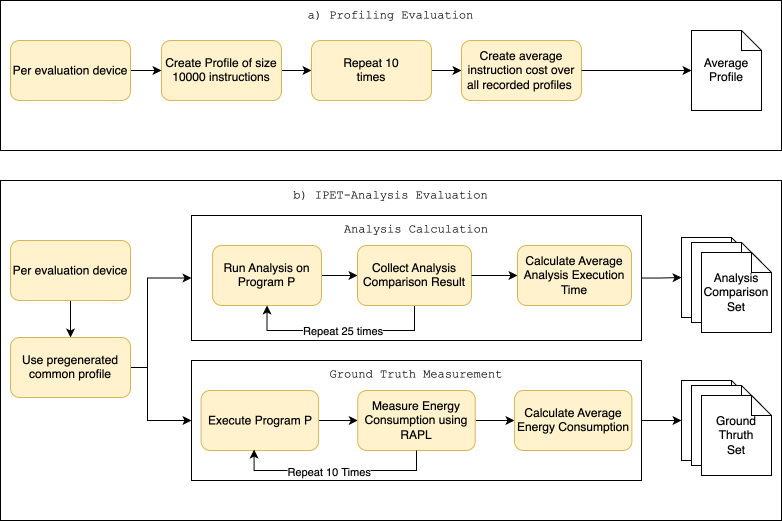

# SPEAR-IPET-evaluation

This repository contains all programs and data required for the evaluation
conducted as part of the master’s thesis "*Hierarchical Worst-Case Energy
Analysis Using Clustered Implicit Path Enumeration with Data-Flow-Driven Path
Refinement and Experimentally Derived Energy Models*".

## Structure

The repository is organized into the following components:

```text
project-root/
│
├── ansible/                # Ansible playbooks for setting up a new evaluation device
│
├── assets/                 # Repository assets
│
├── data/                   # Experimental data collected during our evaluation runs
│
├── evaluation_programs/    # Programs used to perform the evaluation
│
└── scripts/                # Scripts for automation (e.g., visualization, data aggregation, table generation)
```

## Hardware recommendations

While SPEAR and the evaluation is in general device agnostic, we designed our
deployment in this repository specifically for **Ubuntu 24.04**. If you want to
use SPEAR and the evaluation on another Linux based distribution, please refer
for the manual installation of [SPEAR](https://github.com/sse-labs/spear). We
used the release [v0.3.1](https://github.com/sse-labs/spear/releases/tag/v0.3.1) from the SPEAR repository

## Setting up a device

We added an ansible playbook to make the evaluation more streamlined and in order to reduce setup overhead.
To guarantee the easy setup of a device use the following steps. Moving on we use the term "host machine" for the device you are currently working on that will execute the Ansible playbook on another device. The other device is called the "evaluation machine".

1) **Install Ansible**

Make sure you have Ansible installed on your host machine. If it is not installed, use your favorite package manager to get the dependency.

2) **OpenSSH Server**

On the evaluation machine make sure that you have a valid OpenSSH-Server package and that the SSH-Server is running and can be connected to.

3) **Generate a SSH-Key and Copy it to the evaluation machine**
On the host machine generate a SSH-Key using
```
ssh-keygen
```
Make sure you give it a valid name and path. Use an algorithm that suits the evaluation machine you are trying to connect to.
Copy the key over to the machine using
```
ssh-copy-id -i <path_to_your_key> user@host
```
This will use the key located under `<path_to_your_key>` and copy it to the user on the evaluation machine found at the address `host`.
Test your ssh-connection using:
```
ssh -i <path_to_your_key> user@host
```
If the connection works without a login, the key authentication works.

4) **Setting up the ansible script**
Locate the `ansible` folder in a terminal and edit the `inventory.yml` file.
Create a new device entry for your evaluation machine:
```
<device_name>:
    ansible_user: <user>
    ansible_host: <ip>
    ansible_connection: ssh
    ansible_python_interpreter: /usr/bin/python3
    ansible_ssh_private_key_file: ./.ssh_deploy_key
    prefix_path: /opt/sselabs
    is_pipeline: false
    skip_phasar: false
```
Fill in `<device_name>` with a meaningful unique identifier. Add `<user>` as the user you previously copied the ssh key to.
Supply the ip or hostname `<ip>` the evaluation device will be reachable on.

5) **Deploy the playbook**

In order to deploy the ansible playbook, we created a custom deploy script. Call it with the unique identifier of your evaluation machine and the deployment should start:

```
./deploy <device_name>
```

Expect the deployment to take some time depending on the hardware setup you are deploying to.

## Executing the Evaluation

Our evaluation is split into two parts. The whole process is described by the following diagram:



In order to run the evaluation, we prepared multiple evaluation scripts using python.

### Running the Profile Evaluation

To evaluate the profile generation on an evaluation device execute the script `profileevaluator`.
First, navigate into the respective subfolder:
```
cd scripts/profileevaluator
```
Create a virtual environment and source the respective environment
```
python -m venv .venv
source .venv/bin/activate
```
Install the needed dependencies
```
pip install -r requirements.txt
```
Run the script using:
```
sudo .venv/bin/python main.py <Name of the eval device>
```
Choose a meaningful and unique name for `<Name of the eval device>`. The name will be used to store the data generated during the evaluation.

After the evaluation is done, the results can be found in `/opt/sselabs/data/<Name of the eval device>/profile`. The folder `raw` stores all recorded raw profiles during the evaluation.
The file `cpu_stats.csv` provides a summary over all recorded CPU profiles. Additionally, the file `syscall_stats.csv` describes a summary of all system call related values.

### Running the Analysis Evaluation

The analysis can be evaluated using the script `analysisexecuter`.
Navigate into the subfolder:
```
cd scripts/analysisexecuter
```
Create a virtual environment and source it
```
python -m venv .venv
source .venv/bin/activate
```
Install the needed dependencies
```
pip install -r requirements.txt
```
Run the script using:
```
sudo .venv/bin/python main.py <Name of the eval device>
```
Choose a meaningful and unique name for `<Name of the eval device>`. The name will be used to store the data generated during the evaluation.

After the evaluation is done, the results can be found in `/opt/sselabs/data/<Name of the eval device>/analysis`. The analysis folder contains the recorded values in the folder `raw`.
Comprehensive tables are provided as `.csv` format for each program under analysis. `<program name>_analysis_functions.csv` provides an overview over all analyzed functions.
For each analysis method `legacy`, `clustered`, `monolithic` and `clustered cached`, the analyzed energy value as well as information about the ILPs (if used by the
method) are provided. Additionally, the file `<program name>_analysis_summary`
provides a summary of energy calculated for the `main` function of the program
for each analysis method.

The script `incrementalexecuter` is an adapted version of the `analysisexecuter`.
Execute it in the same way to generate the analysis result for the incremental
programs. The results are then found in `/opt/sselabs/data/<Name of the eval device>/incremental`.

### Running the RAPL Measurement

The measurements can be evaluated using the script `groundtruthmeasurements`.
Navigate into the subfolder:
```
cd scripts/groundtruthmeasurements
```
Create a virtual environment and source it
```
python -m venv .venv
source .venv/bin/activate
```
Install the needed dependencies
```
pip install -r requirements.txt
```
Run the script using:
```
sudo .venv/bin/python main.py <Name of the eval device>
```
Choose a meaningful and unique name for `<Name of the eval device>`. The name will be used to store the data generated during the evaluation.

After the evaluation is done, the results can be found in `/opt/sselabs/data/<Name of the eval device>/measurements/raw`. Each program under analysis is indexed. The results recorded
during the measurement are stored for each program in the folder with the respective id. In each id-folder two `.csv` files are stored. `result.csv` stores the recorded energy values and
execution durations of the measurement. The file `statistics.csv` stores a summary over the resulted values.

## Collecting Data

In order to collect data, make sure the needed tools are installed. Use the provided Ansible script to simplify the installation process. For each device that should be evaluated
create a unique identifier that will be used to store the results. Make sure the evaluation device runs a clean OS-Install with no other programs than stock Ubuntu 24.04 and the 
software provided by this evaluation. On the device execute the aforementioned
analysis tools in their respective directory. Make sure to limit the interaction
with the test system to as little as possible. Especially mitigate usage of
the mouse and keyboard. Make sure no docker containers run in the background.

## Our collected data

During our experiments we collected around 5GB of data, which are stored inside
this repository using git LFS. In order to download the data make sure that
git LFS is installed:
```
git lfs install
```

Clone the repository as usual:
```
git clone https://github.com/printerboi/spear-IPET-evaluation.git
```

Pull the LFS data:
```
git lfs pull
```

The data is split into 5 evaluation devices. The specs of the devices can be
seen in the following table:

| ID | CPU | Platform | TDP | RAPL Unit | RAM | External GPU |
|---|---|---|---|---|---|---|
| D1 | Intel i5-11400F | Desktop | 65W | $6.103515625 \cdot 10^{-5}$ | 16GB | Yes |
| D2 | Intel i5-6500T | Desktop | 35W | $6.103515625 \cdot 10^{-5}$ | 16GB | No |
| D3 | Intel i7-1355U | Laptop | 55W | $6.103515625 \cdot 10^{-5}$ | 16GB | No |
| D4 | AMD Ryzen 5 3400G | Desktop | 65W | $1.52587890625 \cdot 10^{-5}$ | 16GB | No |
| D5 | AMD Ryzen 9 7900 | Desktop | 65W | $1.52587890625 \cdot 10^{-5}$ | 32GB | No |

Each device folder contains a set of subfolders:

```
│
├── analysis/                # Results of the analysis evaluation
│
├── measurements/            # Collected measurements
│
└── profile/                 # Collected profiles
```
Additionally, `device01` contains the result of the incremental analysis, which
was only performed for the respective device.

Each of the subfolders contains the raw results collected during the evaluation
as well as the aggregated files generated by the python evaluation scripts.